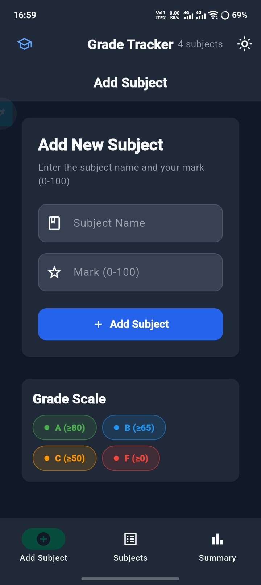
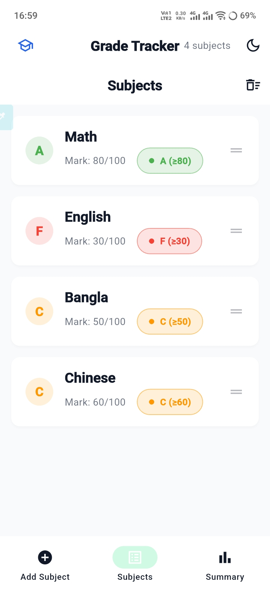
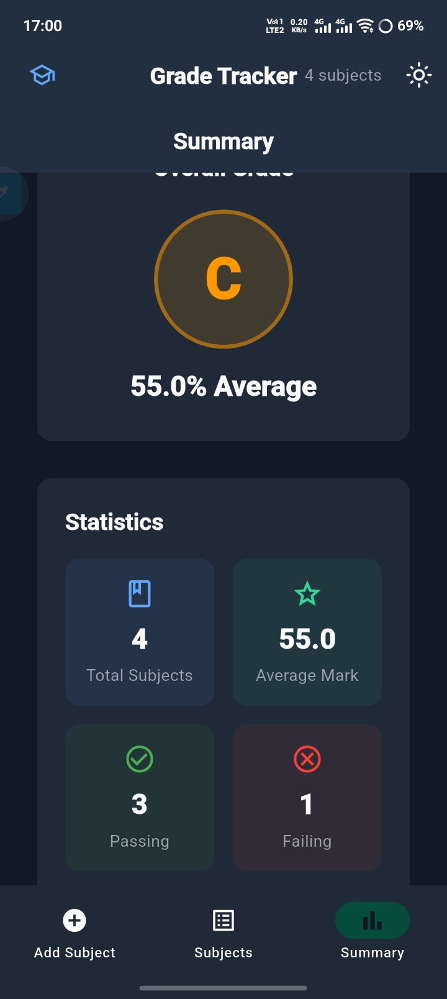

# Grade Tracker

A Flutter application for students to track their grades across subjects.

## Features

- **Add Subject** — Add subjects with names and marks (0-100) with form validation
- **Subject List** — View all subjects with their grades, swipe to delete
- **Summary** — View total subjects, average mark, overall grade, and pass/fail breakdown
- **Light/Dark Theme** — Toggle between custom light and dark themes

## Grade Scale

| Grade | Mark Range |
|-------|-----------|
| A     | ≥ 80      |
| B     | ≥ 65      |
| C     | ≥ 50      |
| F     | < 50      |

## How to Run

1. Ensure Flutter is installed and set up
2. Clone the repository
3. Run `flutter pub get` to install dependencies
4. Run `flutter run` to launch the app

## Screenshots

  
  
  

## Built With

- Flutter
- Provider (state management)
